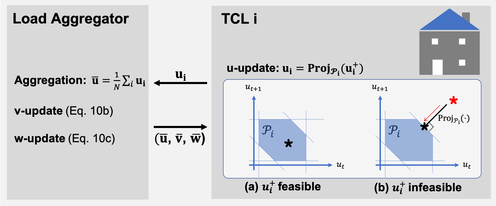

# COHORT: Coordination of Heterogeneous Thermostatically Controlled Loads for Demand Flexibility

This is the official repository that implements the following paper:

> *Bingqing Chen, Jonathan Francis, Marco Pritoni, Soummya Kar, and Mario Bergés. 2020. COHORT: Coordination of Heterogeneous Thermostatically Controlled Loads for Demand Flexibility. In Proceedings of the 7th ACM International Conference on Systems for Energy-Efficient Buildings, Cities, and Transportation (BuildSys '20). ACM, New York, NY, USA, 31–40. https://doi.org/10.1145/3408308.3427980*

[[teaser]](docs/Cohort_in_30s.pdf)[[slides]](docs/slides.pdf)[[paper]](https://dl.acm.org/doi/10.1145/3408308.3427980) 

# Overview
COHORT is a practical, scalable, and versatile solution for coordinating a large population of flexible building loads to jointly provide grid services, while ensuring the end-use requirements are satisfied at individual buildings. 
- Building-level problems, i.e. satisfying end-use requirements, are distributed to and computed in parallel at individual buildings. Therefore, COHORT can incorporate detailed, system-specific dynamics of individual buildings, while remaining computationally scalable to large population sizes.
- We demonstrate the use of COHORT through three distinct use cases: generation following, minimizing ramping, and peak load curtailment. 


**Framework.** The load aggregator and each building coordinates at the level of its power trajectory, u<sub>i</sub>, until a consensus is reached among the population. Each building is responsible for its own control and tracks the agreed upon power consumption profile locally with its preferred strategy. In this work, we used a low-frequency pulse width modulation (PWM) technique to translate continuous power to on/off actuation. 

<!--


**Coordination.** The u-update step is distributed to and computed in parallel at each TCL as a projection operation. The load aggregator calculates u¯, and then updates v¯ and w¯. Finally, the load aggregator broadcasts the u¯, v¯, and w¯ to the population. This procedure repeats until convergence.
-->

# Code Usage
### Clone repository
```
git clone https://github.com/INFERLab/COHORT.git
cd COHORT
```

### Set up the environment 
Set up the virtual environment with your preferred environment/package manager.

The instruction here is based on **conda**. ([Install conda](https://docs.anaconda.com/anaconda/install/))
```
conda create --name cohort-env python=3.7 -c conda-forge -f requirements.txt
condo activate cohort-env
```

<!-- 
Visit Anaconda official for the most recent conda installer for your system (https://www.anaconda.com/products/individual). Follow the installation instructions to install Anaconda on your system (https://docs.anaconda.com/anaconda/install/). 

Example linux instructions for the 2020.07 build:

```
cd
wget https://repo.anaconda.com/archive/Anaconda3-2020.07-Linux-x86_64.sh
bash /path/to/Anaconda3-2020.07-Linux-x86_64.sh
```
-->


### Running
You can replicate our experiments for *Use Case 1: Generation Following* with `main_tracking.ipynb` and *Use Case 2: Minimize Ramping* with `main_ramping.ipynb`.

*Notes.*
- While COHORT is a distributed control framework, all the computation, which includes simulating the populations and solving both grid-level and building level problems, were executed on a single machine for the purpose of our experiment. Thus, the notebooks may take a while to run. You may consider using a smaller populatiaon size, e.g. 100, for faster computation.
- The hardware-in-the-loop simulation experiment involves data traces from private households from ecobee's *Donate Your Data Program*, which are not publicly available. We will work towards making the experiment replicable without potentially violating privacy. 

### Feedback

Feel free to send any questions/feedback to: [Bingqing Chen](mailto:bingqinc@andrew.cmu.edu)

### Citation

If you use COHORT, please cite us as follows:

```
@inproceedings{Chen2020COHORT,
author = {Chen, Bingqing and Francis, Jonathan and Pritoni, Marco and Kar, Soummya and Berg\'{e}s, Mario},
title = {COHORT: Coordination of Heterogeneous Thermostatically Controlled Loads for Demand Flexibility},
year = {2020},
isbn = {9781450380614},
publisher = {Association for Computing Machinery},
address = {New York, NY, USA},
url = {https://doi.org/10.1145/3408308.3427980},
doi = {10.1145/3408308.3427980},
booktitle = {Proceedings of the 7th ACM International Conference on Systems for Energy-Efficient Buildings, Cities, and Transportation},
pages = {31–40},
numpages = {10},
keywords = {demand response, smart thermostats, TCLs, distributed control},
location = {Virtual Event, Japan},
series = {BuildSys '20}
}
```
